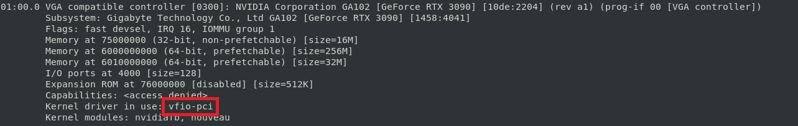
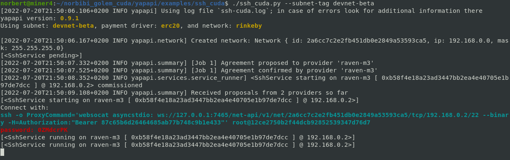
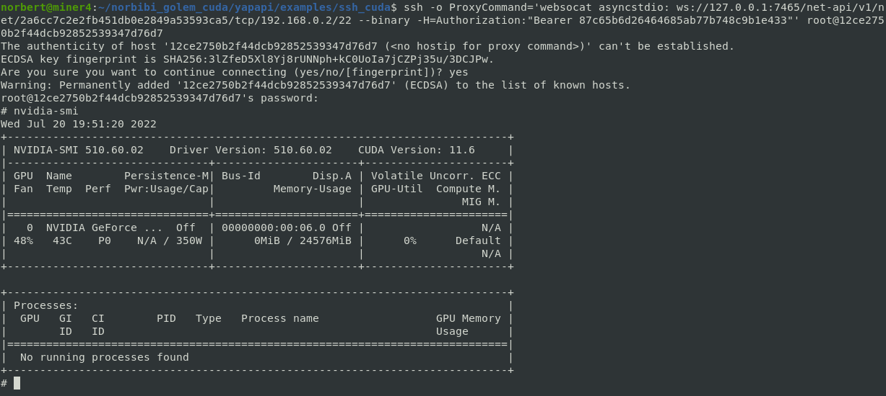
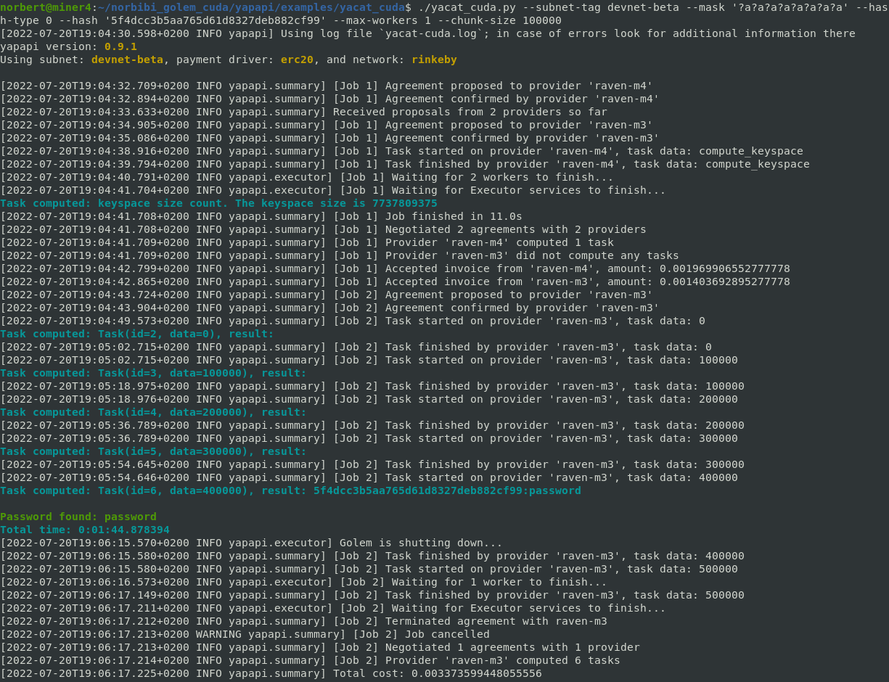
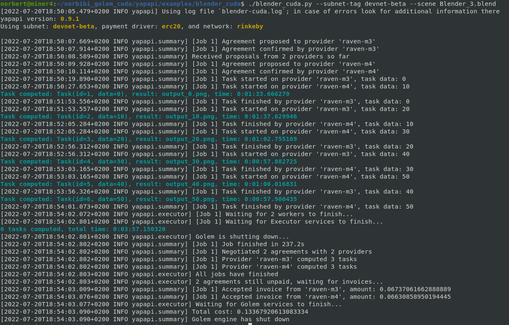
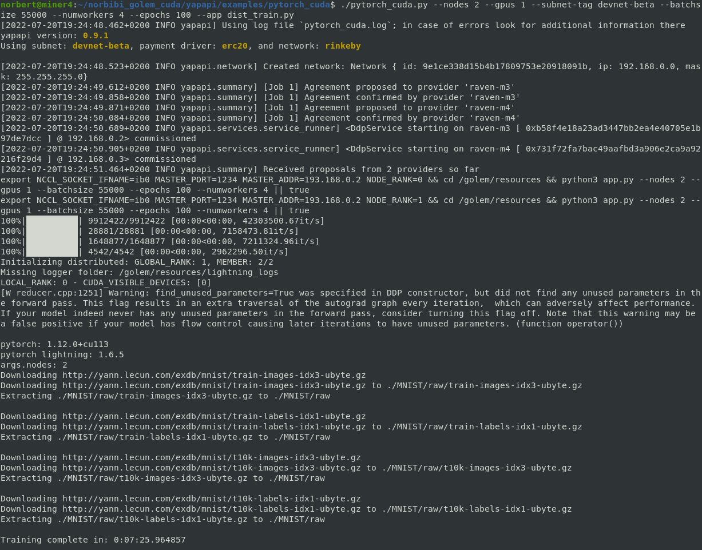
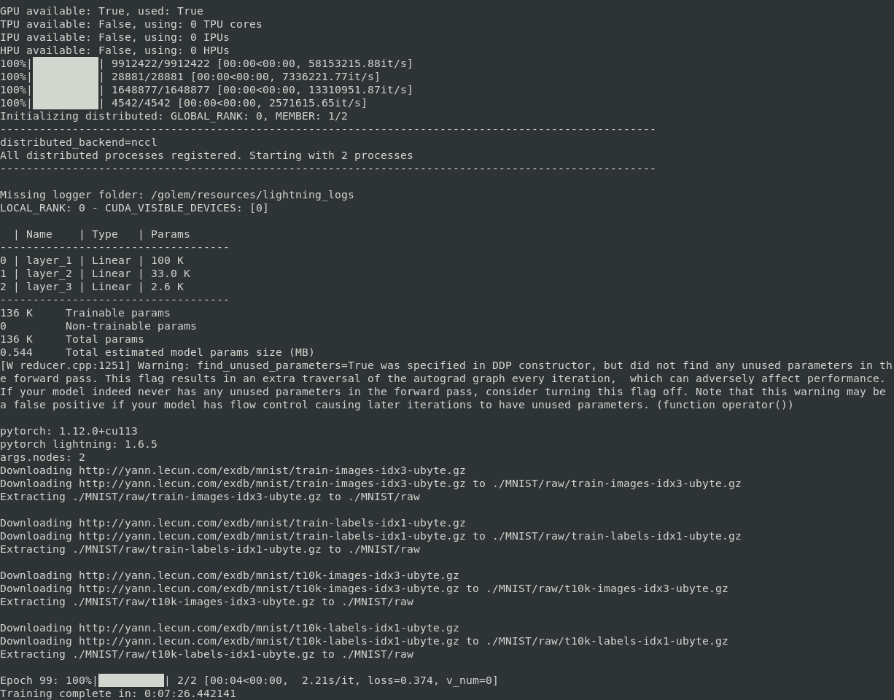
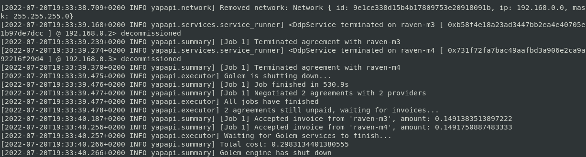
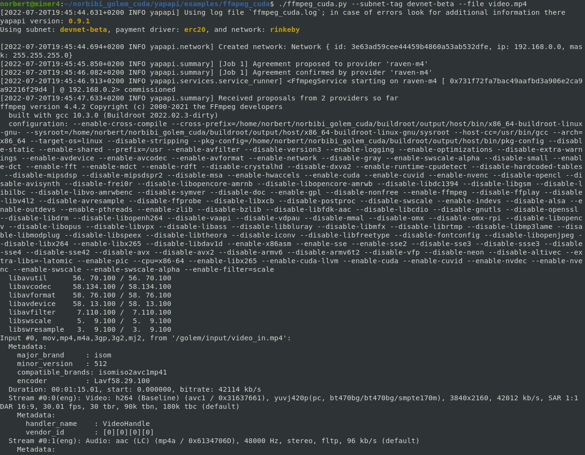
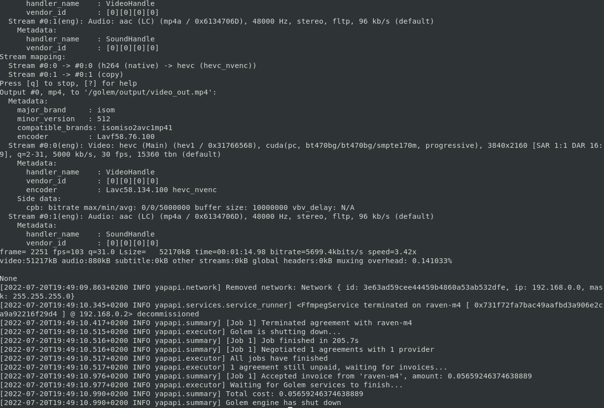

# Golem Network - Yagna CUDA v2
  
The purpose of this repo is to bring CUDA support to the Yagna VM runtime.
  
Providers require 2 GPUs, one for host and second for Yagna VM (GPU passthrough).  
Virtualisation, IOMMU and ACS must be enable in BIOS.  
Kernel ACS patch can be used if ACS isn't available in BIOS.

Other features included:  
- **Infiniband cluster**  
The idea is to provide local Infiniband cluster to Golem Network.  
As with the GPU, this feature requires a dedicated Infiniband card for each provider in the cluster.
- **Internet_outbound**  
Some apps may need to download data from Internet, so this has been added pending official implementation.  

All features are managed by environment variables:
- 'GPU_PCI', if present and different of 'None', is the pci_bus_id of the gpu dedicated to the vm.
- 'IB_PCI', if present and different of 'None', is the pci_bus_id of the Infiniband card dedicated to the vm.
- 'IB_CLUSTER_ID', if 'IB_PCI' set, is a private id shared between cluster providers, a hash is used to advertise capability.
- 'INTERNET_OUTBOUND' allow to enable/disable outbound Internet access through Qemu's NAT (slirp). 

ya-runtime-vm check the availibility of devices before advertise them. 

Example of provider's advertisement used by requestor:  
["vpn", "cuda, GA102 [GeForce RTX 3090], "ib, vBEZnbRqM/xiSqydxOrrZA5z1+UqAs/SXkGAgHe9vOQ", "internet_outbound"]


**Provider installation**  
>  
>Installer will ask you for the 'PID_VID' and 'PCI_BUS_ID' of the devices you want to dedicate to the VM in order to upgrade kernel settings in grub and environment variables in the service file. 
>
>Requirements:
>- packages: git pciutils  
>```
>git clone --recurse-submodules https://github.com/norbibi/golem_cuda.git  
>cd golem_cuda 
>./golem_cuda.sh -i provider  
>```  
>  
>Reboot and check that the pci devices dedicated to the vm are used by vfio-pci driver with the command ```lspci -vnn```, then enable the service.  
> 
>  
>```  
>sudo systemctl enable --now golem_provider.service  
>```  

**Requestor installation (Linux)**
>  
>Requestor is the same as the official, this installer just adds a few steps to request tGLM, create systemd service and put app_key in appkey_env.sh file for easy export. 
>  
>Requirements:
>- packages: jq python3 python3-pip git  
>- python module(s): yapapi  
>```  
>git clone --recurse-submodules https://github.com/norbibi/golem_cuda.git  
>cd golem_cuda  
>./golem_cuda.sh -i requestor  
>```  

**Examples**
>Start requestor service  
>```
>sudo systemctl enable --now golem_requestor.service  
>```
> or if doesn't have systemd (WSL)  
>```
>./golem_cuda.sh -s
>```
>Load app_key in environment
>```
>	source ./appkey_env.sh
>```
>>**cuda_ssh**
>>
>> Same as official ssh app provided by Golem with Cuda support.  
>> Don't forget to put websocat (included in adds folder) in your PATH.  
>>```
>>cd yapapi/examples/cuda_ssh
>>./cuda_ssh.py --subnet-tag devnet-beta
>>```
>>
>>
>
>>**cuda_yacat**
>>
>> Same as official yacat app provided by Golem with Cuda support.
>>```
>>cd yapapi/examples/cuda_yacat
>>./cuda_yacat.py --subnet-tag devnet-beta --mask '?a?a?a?a?a?a?a?a' --hash-type 0 --hash '5f4dcc3b5aa765d61d8327deb882cf99' --max-workers 1 --chunk-size 100000
>>```
>>
>
>>**cuda_blender**
>>  
>> Same as official blender app provided by Golem with Cuda support.
>>```
>>cd yapapi/examples/cuda_blender  
>>./cuda_blender.py --subnet-tag devnet-beta --scene Blender_3.blend
>>```  
>>
>
>>**cuda_pytorch**
>>  
>> Pytorch Lightning with Cuda and Infiniband DDP support.  
>>```
>>cd yapapi/examples/cuda_pytorch  
>>./cuda_pytorch.py --nodes 2 --gpus 1 --subnet-tag devnet-beta --batchsize 55000 --numworkers 4 --epochs 100 --app dist_train.py  
>>```  
>>
>>
>>
>
>>**cuda_ffmpeg**
>>  
>> FFMPEG H264 to H265 converter with Cuda support.
>>```
>>cd yapapi/examples/cuda_ffmpeg  
>>./cuda_ffmpeg.py --subnet-tag devnet-beta --file video.mp4
>>```  
>>
>>

**Builds**  
>  
>Global requirements:
>- Docker
>  
>>**Build provider overlay**
>>
>>Requirements: 
>>- Rust  
>>- package(s): musl musl-tools
>>
>>```
>>git submodule update --init --recursive
>>./golem_cuda.sh -b
>>```
>>Provider overlay is composed of ya-runtime-vm, vmrt, vmlinuz-virt and initramfs.cpio.gz components.  
>>The base docker image is generated at the same time as the kernel.  
>>After build, binaries are saved in binaries folder.  
>
>>**Build cuda app image** (cuda_ffmpeg for example)
>>
>>Requirements:    
>>- python module(s): gvmkit-build  
>>
>>```
>>cd yapapi/examples/cuda_ffmpeg  
>>./build_cuda_ffmpeg.sh
>>```
>>The script build the application docker image, converts it to gvmi, uploads it in Golem repository and updates image hash in the application file.

Thanks you to the Golem team & community as well as my brother Cedric Nerger.  
Golem Network is a great project which deserves to succeed.  
  
Norbert Mauger  
norbert.mauger.private+golem@gmail.com  
https://www.linkedin.com/in/norbert-mauger  

**Donations:**  
- Bitcoin &emsp;&emsp;&emsp;&emsp;&emsp;&emsp;bc1qxll9609n34zqelee99ye0ww4ykmh7g92rw2cpf  
- Ethereum/Polygon&emsp;0xa1B84Ec3B0e2273bBc3752BD6bCF98bCf0F92352  
