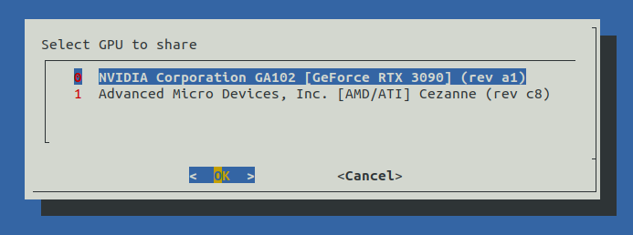
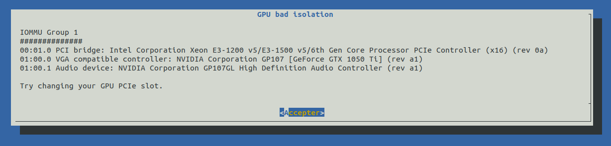

# Golem (0.12.0) Cuda  

Golem Cuda is an overlay for Golem providers to enable GPU computing.

This release has an automated instaler with a terminal menu for GPU selection to simplify setup.  

<p align="center">
 
</p>

Tested only on native machine with Ubuntu 22.04.

**Security aspect**

Distributed computing through a virtual machine requires device isolation, especially with a PCIe device like GPU.  
That's why provider should use motherboard with IOMMU and ACS support to provide device and host isolation.  
This way, each hardware device will be assigned to a different IOMMU group.  

Many motherboard share IOMMU group for multiple devices, so sharing a device of that group forces all devices in the same group to be shared.  
In addition to force sharing of unwanted devices, device compromising can affect all devices of this group.  

Kernel ACS patch can be used to bypass IOMMU and assign one device per vitual IOMMU group,  
 ... please don't use it ... the shared device can access all host RAM, it's a big security hole.   

The installation will stop if your hardware does not suppport device isolation. 

<p align="center">
 
</p>

**Requirements**
- enable IOMMU & ACS in UEFI
- Golem provider v0.12.0
- Docker, Rust (for build only)

**Build (optional)**
- ya-runtime-vm
``` 
cd ya-runtime-vm
cargo build --release
``` 
- vmrt
``` 
cd ya-runtime-vm/qemu
make
``` 
- vmlinuz-virt
``` 
cd docker_golem_cuda_base
make
``` 

**Installation**
``` 
./configure.sh
``` 

**Start & check service golem_provider**
``` 
sudo systemctl enable --now golem_provider.service
journalctl -e -u golem_provider.service
``` 
